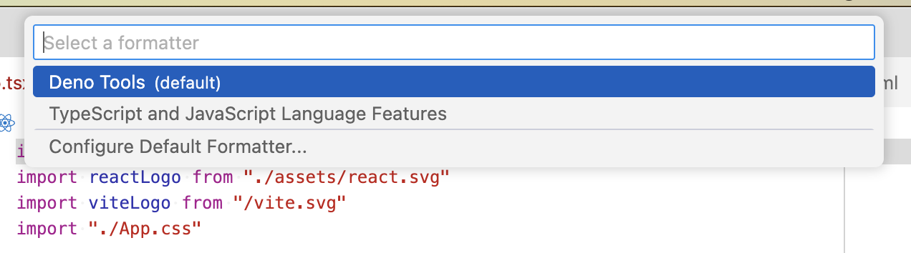
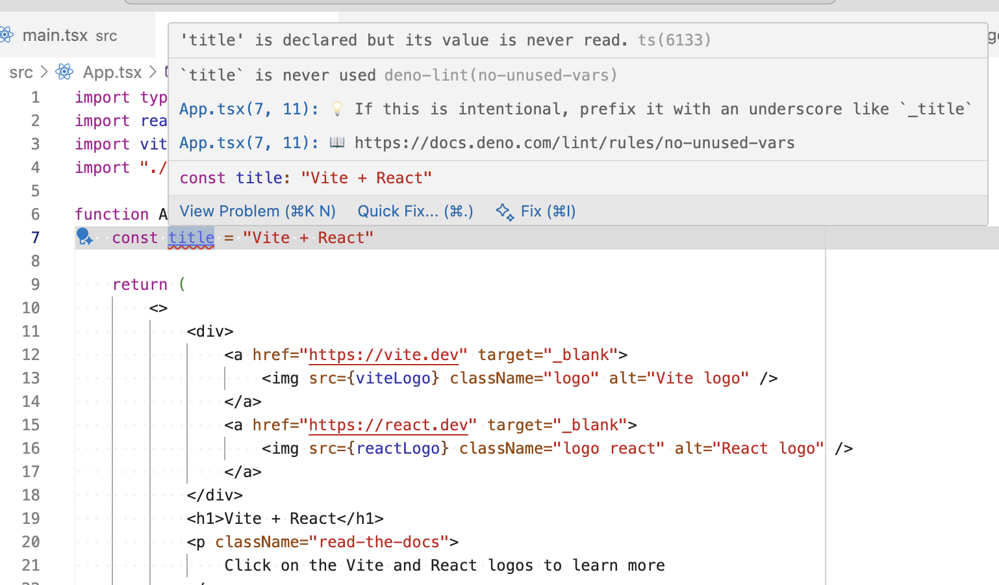
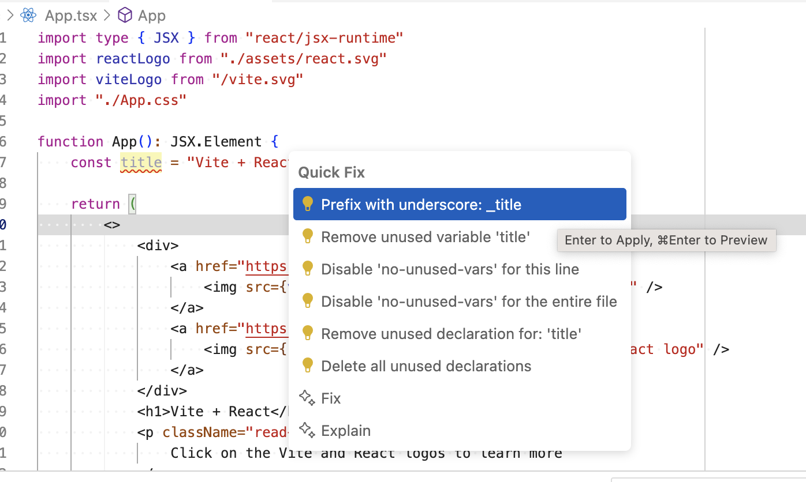

# Deno Tools

[](https://marketplace.visualstudio.com/items?itemName=ayonli.deno-tools)
[](https://marketplace.visualstudio.com/items?itemName=ayonli.deno-tools)
[](https://marketplace.visualstudio.com/items?itemName=ayonli.deno-tools)

**Use Deno tools, such as formatter and linter, without the baggage of Deno LSP.**

Deno Tools is a lightweight VS Code extension that provides Deno's powerful formatting and linting capabilities without requiring the full Deno Language Server Protocol (LSP). Perfect for projects that want to leverage Deno's excellent tooling while maintaining flexibility in their development setup.

## ✨ Features

### ⚙️ **Deno Configuration**

This extension respects `deno.json` or `deno.jsonc` configuration files; automatically finds them
in your project hierarchy and falls back to the user's home directory.

### 🎨 **Code Formatting**

- **Built-in Integration**: Format documents using VS Code's standard formatting functionalities (Format Document, Format Selection, Format on Save, etc.).
- **Multi-Language Support**: Supports TypeScript, JavaScript, JSX, TSX, JSON, JSONC, Markdown, HTML, CSS, SCSS, Sass, Less, Vue, Svelte, Astro, YAML, and SQL.

### 🔍 **Linting**

- **Real-time Diagnostics**: Live linting with detailed diagnostics and helpful hints.
- **Auto-fixes**: Quick fix actions for various rules.
- **Integrity**: Respect `include` and `exclude` settings in `deno.json`.

### 🛠 **Commands**

- **Fix Current File**: Apply all available auto-fixes to the current file (`Deno Tools: Fix Current File`).

## 🎆 Screenshots

### Integrated Code Formatter



### Real-time Linting Diagnostics



### Quick Fix Actions



## 🚀 Quick Start

1. **Install Deno**: Make sure [Deno](https://deno.land/) is installed on your system.
2. **Install Extension**: Install "Deno Tools" from the VS Code marketplace.
3. **Create Deno Config**: Add a `deno.json` or `deno.jsonc` file to your project root (the extension auto-enables when these files are found).
4. **Start Coding**: The extension automatically activates for supported file types in Deno projects.

### Basic Usage

```typescript
// Open any TypeScript/JavaScript file
// Use Shift+Alt+F (Windows/Linux) or Shift+Option+F (macOS) to format
// Linting diagnostics appear automatically as you type

// Create a deno.json file for custom configuration:
{
  "fmt": {
    "lineWidth": 100,
    "indentWidth": 4,
    "singleQuote": false,
    "semiColons": false,
    "proseWrap": "preserve"
  },
  "lint": {
    "rules": {
      "tags": ["recommended"]
    }
  }
}
```

## ⚙️ Configuration

This extension provides several configuration options accessible via VS Code settings:

| Setting                          | Default     | Description                                                                                                                                |
| -------------------------------- | ----------- | ------------------------------------------------------------------------------------------------------------------------------------------ |
| `deno-tools.enable`              | Auto-detect | Enable Deno tools. Can be `true` (all tools), `false` (no tools), or an array of specific tools: `['formatter', 'linter']`.                |
| `deno-tools.linter.lintOnChange` | `true`      | Enable linting while typing (disable to only lint on save/manual triggers)                                                                 |
| `deno-tools.linter.debounceMs`   | `1500`      | Debounce delay in milliseconds for linting after document changes (higher values = less interruption while typing)                         |
| `deno-tools.linter.severity`     | `error`     | Default `error`, set to `warning` or `info` for VS Code to provide informative diagnostics but the rules are not enforced in CI pipelines. |

## 🎯 Supported Languages

| Language   | Formatter | Linter | File Extensions                   |
| ---------- | --------- | ------ | --------------------------------- |
| TypeScript | ✅        | ✅     | `.ts`, `.tsx`, `.mts`, `.cts`     |
| JavaScript | ✅        | ✅     | `.js`, `.jsx`, `.mjs`, `.cjs`     |
| JSON       | ✅        | ❌     | `.json`, `.jsonc`                 |
| Markdown   | ✅        | ❌     | `.md`                             |
| HTML       | ✅        | ❌     | `.html`                           |
| CSS        | ✅        | ❌     | `.css`, `.scss`, `.sass`, `.less` |
| Vue        | ✅        | ❌     | `.vue`                            |
| Svelte     | ✅        | ❌     | `.svelte`                         |
| Astro      | ✅        | ❌     | `.astro`                          |
| YAML       | ✅        | ❌     | `.yml`, `.yaml`                   |
| SQL        | ✅        | ❌     | `.sql`                            |

## 📋 Commands

Access these commands via the Command Palette (`Ctrl+Shift+P` / `Cmd+Shift+P`):

| Command                        | Description                                        |
| ------------------------------ | -------------------------------------------------- |
| `Deno Tools: Fix Current File` | Apply all available auto-fixes to the current file |

## 📝 Usage Tips

### Formatting

- Use standard VS Code formatting shortcuts: `Shift+Alt+F` (Windows/Linux) or `Shift+Option+F` (macOS).
- Right-click and select "Format Document" or "Format Selection".
- Enable "Format on Save" in VS Code settings for automatic formatting.

### Linting

- Diagnostics appear automatically as you type (with configurable debouncing).
- Hover over underlined issues to see detailed information and quick fixes.
- Use "Fix Current File" to apply all available auto-fixes at once.
- Linting respects your `deno.json` configuration for included/excluded files and rules.
- Disable `noUnusedLocals` and `noUnusedParameters` compiler options in `tsconfig.json` in favor of
  the `no-unused-vars` linting rule.

### Performance

- Adjust `deno-tools.linter.debounceMs` if linting feels too intrusive while typing.
- Disable `deno-tools.linter.lintOnChange` to only lint on save and manual triggers.
- The extension is lightweight and doesn't include the full Deno LSP overhead.

## 🔧 Requirements

- **Deno**: Must be installed and available in your system PATH.
- **VS Code**: Version 1.97.0 or higher.
- **Operating System**: Windows, macOS, or Linux.

## 🆚 Comparison with Deno LSP

| Feature          | Deno Tools | Deno LSP |
| ---------------- | ---------- | -------- |
| Formatting       | ✅         | ✅       |
| Linting          | ✅         | ✅       |
| Type Checking    | ❌         | ✅       |
| IntelliSense     | ❌         | ✅       |
| Import Maps      | ❌         | ✅       |
| Go to Definition | ❌         | ✅       |
| Resource Usage   | Low        | High     |
| Setup Complexity | Minimal    | Complex  |
| Configuration    | Simple     | Advanced |

**Choose Deno Tools when:**

- You want lightweight Deno tooling without LSP overhead.
- You're using other TypeScript language servers, like the builtin one.
- You only need formatting and linting capabilities.
- You want simple, zero-configuration setup.

**Choose Deno LSP when:**

- You're building a pure Deno project.
- You need advanced Deno-specific features like import maps and Deno APIs.

## 🤝 Contributing

Contributions are welcome! Please feel free to submit issues, feature requests, or pull requests.

## 📄 License

This extension is licensed under the MIT License.

---

**Enjoy coding with Deno Tools! 🦕**
